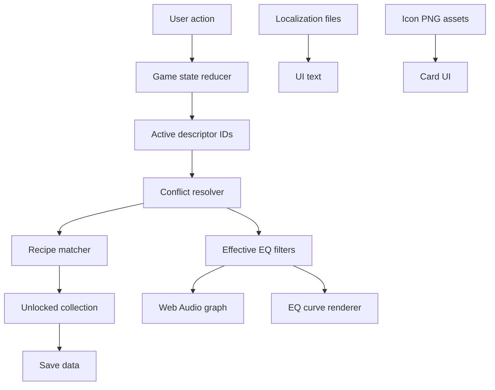

# Descriptor Technical Design

This document is the source-of-truth for implementation and platform decisions: runtime settings, DSP/EQ behavior, curve preview, web/PWA architecture, persistence, localization, testing, and release targets.

## Project Folder Structure

The repository uses this folder structure before feature code is added. Current Markdown planning files live in `docs/`.

Canonical repository shape:

```text
descriptor_game/
  app/
    package.json
    vite.config.ts
    tsconfig.json
    index.html
    public/
      audio/
        demo/
      icons/
        descriptors/
        discoveries/
        regions/
      manifest.webmanifest
    src/
      main.tsx
      app/
        App.tsx
        routes.ts
        screens/
          HomeScreen.tsx
          LearnScreen.tsx
          CraftScreen.tsx
          CollectionScreen.tsx
          SandboxScreen.tsx
          SettingsScreen.tsx
      audio/
        engine/
          WebAudioEngine.ts
          AudioGraph.ts
          TrackLoader.ts
          AudioSafety.ts
        dsp/
          eqFilters.ts
          compressorProfiles.ts
          curveResponse.ts
          loudness.ts
        worklets/
          README.md
        analysis/
          offlineRender.ts
          responseFixtures.ts
      cards/
        descriptorCatalog.ts
        discoveryRecipes.ts
        cardTypes.ts
        cardReducer.ts
        recipeMatcher.ts
        difficulty.ts
      data/
        regions.ts
        tracks.ts
        assetManifest.ts
      i18n/
        en.json
        zh-Hans.json
        de.json
        ja.json
        i18n.ts
      persistence/
        saveData.ts
        storage.ts
        migrations.ts
      ui/
        components/
          CardGrid.tsx
          DescriptorCard.tsx
          DiscoveryCard.tsx
          EqCurveView.tsx
          PlaybackControls.tsx
          LanguagePicker.tsx
        styles/
          tokens.css
          cards.css
          layout.css
      tests/
        recipeMatcher.test.ts
        cardReducer.test.ts
        eqCurve.test.ts
        audioSafety.test.ts
    e2e/
      app.spec.ts
    dist/
  assets-source/
    descriptors/
    region/
    audio/
  docs/
    descriptor-technical-design.md
    descriptor-raw-materials.md
    descriptor-detail-pages.md
    descriptor-dynamic-descriptors.md
    descriptor-spatial-descriptors.md
    descriptor-integrity-descriptors.md
  launcher/
    start-windows.bat
    start-macos.command
    start-linux.sh
    local-server/
      README.md
  tools/
    node/
      optimize-icons.ts
      build-asset-manifest.ts
    python/
      README.md
```

Folder rules:
- `app/` is the Vite TypeScript web application and is the only folder needed for hosted static deployment.
- `app/src/audio/engine/` owns playback, graph wiring, track loading, and safety.
- `app/src/audio/dsp/` owns reusable DSP math and parameter profiles that can be unit-tested without the UI.
- `app/src/audio/worklets/` is reserved for custom real-time DSP only when built-in Web Audio nodes are not enough.
- `app/src/cards/` owns descriptor IDs, recipes, conflict rules, reducer behavior, and difficulty metadata.
- `app/src/data/` owns non-card manifests such as regions, tracks, and generated asset paths.
- `app/public/` contains runtime static assets served by the web build.
- `assets-source/` contains original large art/audio sources; optimized runtime copies go into `app/public/`.
- `docs/` contains the current design Markdown files so the repository root can stay build-friendly.
- `launcher/` contains optional local distribution helpers that serve `app/dist/`.
- `tools/node/` is for asset manifests, image optimization wrappers, and validation scripts that fit naturally in the TypeScript toolchain.
- `tools/python/` is allowed only for optional offline asset/audio preparation, not for the app runtime.

## TypeScript And DSP Decision

Decision: the player-facing game should be fully implemented in TypeScript for version 1. Do not add Python to the hosted app, PWA, local launcher runtime, or browser audio path.

Reasoning:
- The current MVP is spectral descriptor training: peaking EQ filters, A/B switching, intensity scaling, curve rendering, local file import, progress saves, and card logic. These are all natural TypeScript/Web Audio responsibilities.
- The current recipe limit of up to `5` active descriptor filters is small enough for a straightforward Web Audio filter chain.
- The Web Audio API includes the primitives this design needs now or soon: `BiquadFilterNode` for EQ, `DynamicsCompressorNode` for compression training, `WaveShaperNode` for clipping/saturation, `ConvolverNode` for reverb-like spatial cues, `AudioWorkletNode` for custom low-latency processors, and `OfflineAudioContext` for offline analysis/render checks. Reference: [Web Audio API](https://www.w3.org/TR/webaudio-1.0/).
- TypeScript keeps descriptor IDs, recipes, localization keys, save migrations, and DSP profile objects in one typed system.
- A Python runtime would make a static web/PWA MVP impossible without a backend or local native dependency, which conflicts with the sharing goal.

DSP feasibility by area:

| DSP area | TypeScript/Web Audio approach | Python needed for runtime? |
|---|---|---|
| Spectral descriptors | `BiquadFilterNode` peaking EQ chain, gain ramps, dry/wet crossfade | No |
| Curve preview | `getFrequencyResponse` or a tested TS approximation | No |
| Loudness/output safety | gain clamps, conservative trim, optional `OfflineAudioContext` analysis | No |
| Dynamic descriptors | `DynamicsCompressorNode` profiles first; later AudioWorklet/transient shaping if needed | No |
| Clipped/distorted/overdriven | `WaveShaperNode` or AudioWorklet with safe output trim | No |
| Spatial width/crossfeed | channel split/merge, gain, delay, filter, stereo panner nodes | No |
| Reverb/depth cues | `ConvolverNode` with curated impulse responses | No |
| Integrity defects | TS generators for hiss, hum, click, crackle, dropout; curated samples for harder faults | No |
| Advanced HRTF/head tracking | possible later through browser spatial APIs or custom worklets, but not MVP | No for MVP |
| Batch calibration and fixtures | offline scripts can generate JSON/WAV/PNG assets | Optional Python tooling only |

Python policy:
- Do not use Python in the app runtime unless the product direction changes from static web game to backend-assisted tool.
- If Python becomes useful, keep it under `tools/python/` for offline jobs such as audio fixture generation, impulse-response preparation, loudness batch checks, spectrogram exports, or one-off data conversion.
- Outputs from Python tools must be checked into `app/public/` or `app/src/data/` as static assets or JSON so the game remains TypeScript-only at runtime.
- Prefer TypeScript/Node for validation and build scripts when the same job can be done cleanly there.

## Runtime Settings

| Setting | Current value or behavior | Game interpretation |
|---|---|---|
| Default intensity | `1.0`, shown as `100%` | normal power |
| Minimum intensity | `0.5`, shown as `50%` | subtle training or easy mode |
| Maximum intensity | `1.8`, shown as `180%` | exaggerated training or dramatic mode |
| Intensity scaling | multiplies every active filter gain only | one knob changes all chosen traits |
| Frequency/Q scaling | unchanged by intensity | descriptors keep their identity |
| Empty descriptor set | calls `clearEq()` | neutral state |
| Reset | clears descriptors, focus, replacements, intensity, and EQ | return to silence/neutral lab |
| Flat A/B mode | `setPlayingFlat(true)` bypasses EQ | compare original against transformed sound |
| Processed mode | `setPlayingFlat(false)` applies EQ | hear the chosen descriptor curve |
| Headphone hint | appears for frequencies `<= 63 Hz` or `>= 16000 Hz` if no headphones are detected | require better gear for extreme clues |
| Discovery persistence | `SharedPreferences`, file `descriptor_discoveries`, key `unlocked_recipe_ids` | local collection progress |

Playback/content settings:
- Player can choose bundled tracks from `app/src/main/assets/tracks`.
- Player can import audio from device.
- Accepted import extensions include `wav`, `mp3`, `ogg`, `flac`, `m4a`, `aac`.
- Current engine rejects tracks longer than `15` minutes.
- Current decode safety limit is `64 MiB` of decoded PCM16.
- Bundled tracks currently include:
  - `02. No Sanctuary Here.wav`
  - `04. Shadow.wav`
  - `06. Fragments of Time.wav`

## EQ Engine Rules

Descriptor filters are applied through the native multi-band EQ path.

DSP model:
- Each descriptor contributes one peaking EQ filter.
- Active descriptors are flattened into arrays of frequencies, gains, and Q values.
- Native processing uses per-channel biquads.
- A/B mode crossfades between dry and wet paths.
- EQ parameter smoothing prevents abrupt jumps.
- Output guard limits excessive amplitude.

Important limits:

| Engine limit | Value |
|---|---:|
| Native max EQ bands | `16` |
| JNI max EQ bands | `8` |
| Frequency clamp | `20 Hz` to `0.95 * Nyquist` |
| Gain clamp | `-24 dB` to `+24 dB` |
| Q clamp | `0.05` to `18.0` |
| EQ smoothing time | `0.020 sec` |
| A/B crossfade time | `0.008 sec` |
| Playback ramp time | `0.008 sec` |
| Loop crossfade | `256 frames` |
| Max output amplitude guard | `0.98` |

Game caution:
- Current recipes can require up to `5` active descriptor filters, which is below the JNI max of `8`.
- If a future game adds bigger recipes, the JNI max should be raised or recipes should be consolidated.

## Curve Preview Rules

The screen graph is a teaching visualization, not an exact native biquad response plot.

Current preview behavior:
- X-axis spans `31 Hz` to `16 kHz`.
- Y-axis spans `-18 dB` to `+18 dB`.
- Frequency labels: `31`, `63`, `125`, `250`, `500`, `1k`, `2k`, `4k`, `8k`, `16k`.
- Each descriptor filter is drawn as a Gaussian-like bell around its center frequency.
- Combined response is the sum of all active descriptor preview bells.
- Active curve label shows the primary discovery if one is matched.

Game use:
- The curve can become a map, attack shape, puzzle trace, or creature silhouette.
- Exact DSP and readable visuals do not need to be identical, as long as the player learns a trustworthy relationship.

## Platform Strategy

Recommended first platform: web game.

MVP delivery target:
- The MVP should export as a static web build.
- It should run from a normal `http://` or `https://` server.
- It should also support a one-click local launcher for colleagues, such as `Start Descriptor Game.bat`, which starts a tiny local HTTP server and opens the browser.
- Avoid relying on direct `file://` opening because browser audio, fetch, service-worker, and asset-loading behavior can become inconsistent.
- This is still a web game, not a native desktop app. The one-click version is only a convenient local web server wrapper.

Reason:
- Colleagues can open a link without installing anything.
- Colleagues can also receive a zipped local build and start it with one click if hosting is inconvenient.
- It works on Windows, macOS, Android, iOS, and tablets.
- It is easier to test quickly during development.
- It supports collectible-card UI well.
- It can use Web Audio for EQ, A/B switching, intensity, and imported local audio.
- It can become a PWA later for offline use.
- It can be wrapped later into Android or desktop builds if needed.

Platform comparison:

| Platform | Strength | Weakness | Best use |
|---|---|---|---|
| Web game | easiest sharing, fastest feedback, cross-platform | browser audio/device differences need testing | first colleague-ready version |
| Local web launcher | one-click start while still running as a web game | needs a bundled or available local HTTP server | MVP zip for colleagues |
| PWA | web sharing plus offline/install-like behavior | still browser-based, audio policies vary | ideal upgrade after the web prototype stabilizes |
| Android game | good mobile fit, matches EarMaster roots | install friction, Play Store/APK handling, Android-only | later mobile-native version |
| Portable Windows exe | simple for Windows colleagues, offline friendly | Windows-only, more packaging/security friction | later internal demo or event build |

Recommended release path:
1. Build a static web game prototype first.
2. Support two MVP launch paths: hosted `http(s)` and local one-click HTTP launcher.
3. Make it installable/offline as a PWA when the loop feels good.
4. Package Android after the card collection and audio loop are proven.
5. Create a native desktop build only if colleagues specifically need more than a local web launcher.

Technical direction for web:
- Use Web Audio API for parametric EQ filters.
- Use local browser storage for collection progress.
- Use bundled demo tracks plus local file import.
- Keep card data in localization-friendly JSON.
- Support English, Chinese, German, and Japanese from the start.
- Treat the app as a static site: no backend, accounts, or server-side processing.
- For local sharing, bundle a minimal HTTP server or launcher script that serves the built `app/dist/` folder.

Important caveat:
- Browser playback can vary by device, browser, speaker, and headphone output. The game should keep the same headphone recommendation idea, especially for sub-bass and air-band cards.

## MVP Implementation Plan

The MVP should be a vertical slice that proves the game loop, not a complete seven-region release. The key question is: does collectible descriptor play feel fun and useful when combined with real listening?

MVP north star:
- A colleague opens a static web link or one-click local launcher.
- They learn all `18` basic spectral descriptor cards through three short Spectrum Gates.
- They unlock the Region `A` map path and craft `Powerful`, `Impactful`, `Energetic`, and `Exciting`.
- They can replay unlocked cards in Collection and Sandbox using flat/processed A/B.
- Their progress survives reloads.

### MVP Scope Snapshot

| Area | MVP scope |
|---|---|
| Runtime | Static TypeScript web app in `app/`; no backend and no Python runtime |
| Distribution | hosted `http(s)` build plus one-click local launcher serving `app/dist/` |
| Audio | Web Audio EQ engine, flat/processed switching, intensity scaling, safety clamps |
| Tracks | `1` required bundled loop, `3` preferred loops if file size is reasonable |
| Basic progression | three parallel Spectrum Gates: Bass, Mid, Treble |
| Basic cards | all `18` spectral basics |
| Region map | seven region cards visible; only Region `A` playable |
| Region `A` discoveries | `Powerful`, `Impactful`, `Energetic`, `Exciting` |
| Collection | basics plus Region `A` discoveries, with locked/unlocked states |
| Sandbox | apply unlocked basics and discoveries to bundled demo audio |
| Persistence | local save for unlocked basics, discoveries, settings, selected language |
| Localization | English complete; Chinese/German/Japanese key files present with MVP-ready text |
| PWA | manifest-ready structure only; service worker can wait until after the MVP loop works |

### MVP Player Flow

1. First launch shows the card-game home screen with `Learn`, `Collection`, `Sandbox`, and locked region previews.
2. Player enters any Spectrum Gate.
3. Gate demonstrates the gift pair with exaggerated A/B:
   - Bass: `Rumble`, `Thin`
   - Mid: `Warm`, `Hollow`
   - Treble: `Bright`, `Dull`
4. Gift pair becomes playable immediately.
5. Gate asks the player to catch one friendly third card:
   - Bass: `Thump`
   - Mid: `Boxy`
   - Treble: `Harsh`
6. Gate unlocks the remaining three cards through anchor-based A/B choices:
   - Bass: `Boomy`, `Punchy`, `Muddy`
   - Mid: `Honky`, `Nasal`, `Shouty`
   - Treble: `Sibilant`, `Shrill`, `Airy`
7. After all `18` basics are playable, the full region map opens.
8. Player enters Region `A`: Thunderstep Highlands.
9. Region `A` gives emotional crafting clues and lets the player combine known cards.
10. Correct recipes unlock discoveries:
    - `Powerful = Rumble + Thump`
    - `Impactful = Thump + Punchy`
    - `Energetic = Rumble + Thump + Bright`
    - `Exciting = Rumble + Thump + Bright + Airy`
11. Unlocked discoveries become playable macro cards that expand to their basic ingredients.
12. Player can inspect cards in Collection and apply unlocked cards in Sandbox.

### MVP Milestones

| Milestone | Goal | Main deliverables | Done when |
|---|---|---|---|
| `M0` Scaffold | make the repo runnable | Vite React/TS app, lint/test scripts, base CSS tokens, placeholder screens | `npm run dev`, `npm run build`, and `npm test` run inside `app/` |
| `M1` Data foundation | make cards real data | descriptor catalog, Region `A` recipes, asset manifest, localization keys, validation tests | tests prove unique IDs, valid recipes, valid conflicts, existing asset paths |
| `M2` Audio foundation | prove browser DSP | `WebAudioEngine`, EQ chain, flat/processed A/B, intensity scaling, safety clamps, bundled loop loading | selecting descriptors audibly changes a loop and A/B crossfades cleanly |
| `M3` Card play surface | make the core toy usable | card grid, active-card tray, replacement/conflict feedback, curve preview, playback controls | player can select compatible cards, replace conflicts, clear state, and see/hear the result |
| `M4` Spectrum Gates | unlock all basics | gate screen, gift demonstrations, first-catch tasks, anchor unlock tasks, progress save | a new player can unlock all `18` basics and reload without losing progress |
| `M5` Region `A` crafting | prove discovery loop | region map, Region `A` screen, recipe hints, crafting table, discovery unlock animation/state | player can unlock `Powerful`, `Impactful`, `Energetic`, and `Exciting` |
| `M6` Collection and Sandbox | make rewards useful | collection book, discovery macro playback, sandbox track selector, intensity mode switch | unlocked discoveries are visible, replayable, and usable as shortcut cards |
| `M7` Shareable build | make colleague testing possible | production build, local launcher, lightweight README, smoke tests | colleague can open hosted build or launcher and complete the happy path |

### Work Breakdown

M0 scaffold:
- Create `app/package.json`, `vite.config.ts`, `tsconfig.json`, `index.html`, `src/main.tsx`, and `src/app/App.tsx`.
- Choose React unless a later decision explicitly chooses vanilla TypeScript.
- Add scripts: `dev`, `build`, `preview`, `test`, `test:watch`.
- Add Vitest and Playwright configuration placeholders.
- Add base layout and tokens in `src/ui/styles/`.

M1 data foundation:
- Encode the `18` basic descriptors from `descriptor-raw-materials.md`.
- Encode the `4` Region `A` recipes first.
- Keep full `30` discovery records optional until after Region `A` works.
- Add gate definitions in `src/data/regions.ts` or a dedicated `gateProgress.ts`.
- Add asset manifest entries for descriptor and region images.
- Add localization keys for every visible MVP label, hint, button, setting, and card summary.
- Add validation tests before UI depends on the data.

M2 audio foundation:
- Use one `HTMLAudioElement` with `MediaElementAudioSourceNode` for MVP playback.
- Route dry and wet paths through Web Audio gains.
- Build the wet chain from active `BiquadFilterNode` peaking filters.
- Clamp frequency, gain, and Q according to the engine rules.
- Ramp EQ parameter changes over `20 ms`.
- Crossfade flat/processed over about `8 ms`.
- Add conservative master trim or gain guard for high practice intensity.
- Handle suspended `AudioContext` with a user-gesture start button.

M3 card play surface:
- Build `DescriptorCard`, `CardGrid`, `PlaybackControls`, and `EqCurveView`.
- Implement active-card tray with clear cards and flat/processed controls.
- Implement conflict replacement using the catalog conflict rules.
- Show replacement as a game event, for example body gained/lost, not as an error.
- Draw the curve from the same effective filters passed to the audio engine.
- Keep technical details behind a compact card-back/details view.

M4 Spectrum Gates:
- Build a `LearnScreen` with three gate tabs/cards.
- Use gift cards as guided demonstrations, not quizzes.
- Implement first-catch and later-unlock challenge state.
- Use high practice intensity for early challenges.
- Keep choices friendly: one target plus familiar anchors.
- Persist gate progress after each card unlock.
- Unlock the region map only when all basics are learned.

M5 Region `A` crafting:
- Build a simple `RegionMapScreen` or home section with seven visible regions.
- Lock Regions `B` through `G` as preview cards.
- Make Region `A` enterable after all basics are learned.
- Build a crafting table where active basics can match recipes.
- Show silhouettes or vague clues before discovery unlock.
- Reveal exact ingredients after unlock.
- Treat `Powerful -> Energetic -> Exciting` as the core evolution path.
- Treat `Impactful` as the side branch that teaches `Thump + Punchy`.

M6 Collection and Sandbox:
- Collection groups: `Basics`, `Region A Discoveries`, `Locked Discoveries`.
- Unlocked basics show label, icon, summary, and playback.
- Locked cards show silhouette/card back and hint state only.
- Discovery cards play as macros by expanding to ingredient basics.
- Sandbox supports bundled track selection, flat/processed, practice/rating intensity, and unlocked-card playback.
- Imported audio remains a post-MVP feature unless M0-M6 finish early.

M7 shareable build:
- Build `app/dist/` with `npm run build`.
- Add `launcher/start-windows.bat` and companion scripts that serve `app/dist/`.
- Prefer a Node/static-server path for distribution; keep `python -m http.server` as internal fallback only.
- Smoke test Chrome desktop and Edge desktop before colleague sharing.
- Record known browser/audio caveats in a short README.

### MVP Content Checklist

Basic cards:

| Gate | Gift pair | First catch | Later unlocks |
|---|---|---|---|
| Bass | `Rumble`, `Thin` | `Thump` | `Boomy`, `Punchy`, `Muddy` |
| Mid | `Warm`, `Hollow` | `Boxy` | `Honky`, `Nasal`, `Shouty` |
| Treble | `Bright`, `Dull` | `Harsh` | `Sibilant`, `Shrill`, `Airy` |

Region `A` discoveries:

| Discovery | Tier | Ingredients | MVP role |
|---|---|---|---|
| `Powerful` | Combo | `Rumble + Thump` | first bass-force discovery |
| `Impactful` | Combo | `Thump + Punchy` | side branch for focused impact |
| `Energetic` | Big combo | `Rumble + Thump + Bright` | bass force with shine |
| `Exciting` | Mega combo | `Rumble + Thump + Bright + Airy` | apex reward for the first region |

Required screens:
- Home / region preview
- Learn / Spectrum Gates
- Region `A` crafting
- Collection
- Sandbox
- Settings

Required controls:
- Start/resume audio
- Play/pause
- Flat/processed A/B
- Practice/rating intensity switch
- Intensity slider
- Clear active cards
- Language picker
- Reset progress

### MVP Test Plan

Unit tests:
- Descriptor IDs are unique.
- Recipe IDs are unique.
- Recipe ingredients exist.
- Recipe ingredients do not conflict.
- Toggle removes conflicting descriptors in both directions.
- Matched discoveries sort by ingredient count, priority, then catalog order.
- Discovery macro cards expand to the expected basics.
- Save migrations can load the current schema.
- Localization keys exist for every MVP card and visible screen label.

Audio tests:
- Effective gains clamp to `-24..+24 dB`.
- Frequencies clamp to `20 Hz..0.95 * Nyquist`.
- Q clamps to `0.05..18.0`.
- Empty descriptor state returns no filters and clears the EQ chain.
- Curve values remain finite for every MVP card and Region `A` recipe.

Browser tests:
- App loads and starts audio only after a user gesture.
- Selecting a card updates active card state and processed audio.
- A/B toggle changes flat/processed mode.
- Gate progress unlocks and persists after reload.
- Region `A` unlocks after all basics are learned.
- Crafting `Rumble + Thump` unlocks `Powerful`.
- Playing `Exciting` applies `Rumble + Thump + Bright + Airy`.
- Language switch changes visible labels.

Manual listening checks:
- Chrome desktop: primary development target.
- Edge desktop: likely Windows colleague target.
- One mobile browser: layout and audio gesture check.
- At least one headphone pass for `Rumble`, `Airy`, and `Exciting`.

### MVP Non-Goals

- All seven regions fully playable.
- Full Review Lab.
- Imported songs.
- Dynamic, spatial, or integrity descriptor systems.
- Player-created descriptors.
- Cloud accounts or sync.
- Android package.
- Native desktop executable.
- Service-worker offline cache.
- Complex animations beyond useful unlock and feedback moments.
- Technical EQ pages as the main user-facing experience.

### MVP Distribution Options

| Option | What the player does | Technical form | When to use |
|---|---|---|---|
| Hosted web game | opens a shared `https://` link | static site hosted on GitHub Pages, Netlify, Vercel, or an internal server | easiest colleague feedback |
| Local HTTP launch | double-clicks a launcher file | zipped `app/dist/` folder plus tiny local server script | useful when one-click local sharing is needed |
| Dev server launch | runs `npm run dev` | Vite development server | developer-only iteration |

Local launcher requirement:
- Start a local server, for example at `http://localhost:4173`.
- Open the default browser automatically.
- Serve the same production build as the hosted version.
- Avoid Electron/Tauri/native packaging for MVP.
- Avoid requiring Python for colleagues.

### MVP Acceptance Criteria

A colleague-ready MVP is complete when:
- It opens from a shared web link.
- It opens from a one-click local HTTP launcher.
- It plays at least one bundled demo track.
- It can A/B flat versus processed audio.
- It includes all `18` basic cards.
- A new player can unlock all `18` basic cards.
- Region `A` unlocks after all basics are learned.
- The player can craft and unlock `Powerful`, `Impactful`, `Energetic`, and `Exciting`.
- Unlocked discovery cards are saved locally.
- Unlocked discovery cards are playable in Sandbox.
- English UI text is complete and the other MVP locale files are structurally complete.
- The app requires no Python runtime, backend, account, or install step.
- Chrome desktop and Edge desktop pass the happy path.
- The technical foundation can add the remaining regions without changing descriptor IDs, recipe IDs, save shape, or audio routing.

## Technical Documentation

This section describes a web-first implementation for the independent collectible-card ear-training game.

### Technical Goals

Primary goals:
- Build a colleague-shareable web game with no installation required.
- Preserve the current Descriptor Playground EQ behavior closely enough that the learning value remains trustworthy.
- Make the game feel like a collectible card game rather than a technical EQ utility.
- Support English, Chinese, German, and Japanese from the beginning.
- Keep player audio private when they import local tracks.
- Allow the game to become a PWA, Android package, or portable desktop app later.

Non-goals for the first version:
- Exact native Android Oboe parity.
- Multiplayer.
- Server-side accounts.
- Cloud sync.
- Real-time output-device detection.
- Pro audio DAW-level metering.

### Recommended Stack

Recommended initial stack:

| Layer | Choice | Reason |
|---|---|---|
| Language | TypeScript | safer card data, audio state, and localization keys |
| Build tool | Vite | fast static web build and simple local development |
| UI | React or vanilla TypeScript components | card UI, state-driven screens, easy PWA path |
| Audio | Web Audio API | native browser EQ, gain routing, A/B switching |
| State | small reducer/store | deterministic card toggles and discovery matching |
| Persistence | localStorage first, IndexedDB later if needed | simple collection saves; room for imported-track metadata |
| Styling | CSS modules or plain CSS variables | easy theming and card layout |
| Testing | Vitest plus Playwright | logic tests and browser/audio UI checks |
| Offline tools | TypeScript/Node first; optional Python only under `tools/python/` | keep the app runtime static and browser-native |
| Packaging | static hosting plus one-click local HTTP launcher, PWA second | easy colleague sharing with or without hosting |

Avoid for version 1:
- Heavy game engines unless animations become central.
- Backend server dependencies.
- Complex auth.
- Native desktop packaging before the web loop is proven.

### Project Structure Reference

Distribution notes:
- The canonical folder structure is defined at the top of this document.
- `app/dist/` is the production web build and should be deployable to any static HTTP host.
- `launcher/` contains optional one-click helpers that serve `app/dist/` locally and open the browser.
- The launcher scripts are distribution helpers, not the primary app source.

### High-Level Architecture



Architecture principles:
- Descriptor IDs are stable internal keys and are never translated.
- Localization affects labels, summaries, hints, and explanations only.
- Recipes reference descriptor IDs, not localized names.
- Discovery cards are macro cards: after unlock, playing a discovery card applies its ingredient filters.
- Audio state and game state should be separate. The game decides what should be active; the audio engine only applies filters and playback mode.

### Core Data Model

Use stable IDs from the current Android catalog.

Descriptor card:

```ts
type DescriptorGroup = "bass" | "mid" | "treble";

type EqFilterSpec = {
  frequencyHz: number;
  gainDb: number;
  q: number;
};

type DescriptorCard = {
  id: string;
  role: "basic";
  group: DescriptorGroup;
  aliases: string[];
  filters: EqFilterSpec[];
  conflictsWith: string[];
  icon: {
    src: string;
    altKey: string;
  };
  learning: {
    recommendedStartIntensity: number;
    revealCurveAfterCompletions: number;
    headphoneRecommended: boolean;
  };
  textKeys: {
    label: string;
    summary: string;
  };
};
```

Discovery card:

```ts
type DiscoveryTier = "combo" | "big_combo" | "mega_combo";

type DiscoveryCard = {
  id: string;
  role: "discovery";
  tier: DiscoveryTier;
  ingredientIds: string[];
  priority: number;
  icon: {
    src: string;
    lockedSrc?: string;
    altKey: string;
  };
  unlock: {
    hintLevel: "hidden" | "family_hint" | "partial_recipe" | "revealed";
    playableAfterUnlock: boolean;
  };
  textKeys: {
    label: string;
    explanation: string;
    hint: string;
  };
};
```

Localization entry example:

```json
{
  "card.rumble.label": "Rumble",
  "card.rumble.summary": "Deep sub-bass movement that is felt more than heard.",
  "card.rumble.alt": "Rumble descriptor card",
  "recipe.tinny.label": "Tinny",
  "recipe.tinny.explanation": "Weak body plus upper edge.",
  "recipe.tinny.hint": "A thin sound with a sharp upper edge."
}
```

### Card State Model

Recommended runtime state:

```ts
type GameMode = "learn" | "craft" | "collection" | "sandbox";
type PlaybackMode = "flat" | "processed";
type IntensityMode = "practice" | "rating";

type GameState = {
  mode: GameMode;
  locale: "en" | "zh-Hans" | "de" | "ja";
  selectedTrackId: string | null;
  activeBasicIds: string[];
  activeDiscoveryId: string | null;
  focusedCardId: string | null;
  playbackMode: PlaybackMode;
  intensityMode: IntensityMode;
  practiceIntensity: number;
  ratingIntensity: number;
  unlockedDiscoveryIds: string[];
  learnedBasicIds: string[];
  curveUnlockedForBasicIds: string[];
  completedChallenges: Record<string, number>;
};
```

Reducer actions:
- `select_basic_card`
- `deselect_basic_card`
- `play_discovery_card`
- `clear_cards`
- `set_intensity_mode`
- `set_practice_intensity`
- `set_rating_intensity`
- `set_playback_mode`
- `complete_learning_step`
- `unlock_discovery`
- `set_locale`
- `select_track`

### Basic Card Toggle Algorithm

The web game should keep the same replacement behavior as the current Android catalog.

```ts
function toggleBasicCard(activeIds: string[], descriptorId: string): string[] {
  const descriptor = descriptorById(descriptorId);
  if (!descriptor) return activeIds;

  if (activeIds.includes(descriptorId)) {
    return activeIds.filter((id) => id !== descriptorId);
  }

  const conflictingIds = activeIds.filter((activeId) => {
    const active = descriptorById(activeId);
    return descriptor.conflictsWith.includes(activeId) ||
      (active?.conflictsWith.includes(descriptorId) ?? false);
  });

  const nextIds = activeIds
    .filter((id) => !conflictingIds.includes(id))
    .concat(descriptorId);

  return sortByCatalogOrder(unique(nextIds));
}
```

Design rule:
- The UI should describe replacement as transformation or refinement, not failure.
- Example copy direction: "Warm replaced Hollow" is technical; "The sound gained body and lost its hollow center" is more game-like.

### Recipe Matching Algorithm

```ts
function matchedDiscoveries(activeIds: string[]): DiscoveryCard[] {
  const active = new Set(activeIds);

  return discoveryCards
    .map((recipe, index) => ({ recipe, index }))
    .filter(({ recipe }) =>
      recipe.ingredientIds.every((id) => active.has(id))
    )
    .sort((a, b) => {
      const ingredientDelta = b.recipe.ingredientIds.length - a.recipe.ingredientIds.length;
      if (ingredientDelta !== 0) return ingredientDelta;

      const priorityDelta = b.recipe.priority - a.recipe.priority;
      if (priorityDelta !== 0) return priorityDelta;

      return a.index - b.index;
    })
    .map(({ recipe }) => recipe);
}
```

Unlock behavior:
- Every matched recipe is added to the collection.
- The primary discovery is the first result after sorting.
- The active label can show the primary discovery once unlocked.
- Before unlock, the active label can show a vague clue or silhouette.

### Discovery Cards As Playable Cards

After unlock, discovery cards can become playable macro cards.

When a player activates a discovery card:
1. Clear current basic cards or ask whether to replace the current hand.
2. Expand the discovery into its ingredient basic descriptors.
3. Apply those basic filters.
4. Display the discovery card as the active identity.
5. Let the player inspect the ingredients after unlock.

Recommended version 1 behavior:
- Discovery cards are single active macro cards.
- A played discovery card replaces the current active basics.
- The player can then switch to "inspect ingredients" to see the underlying basics.

Avoid in version 1:
- Stacking multiple discovery cards.
- Discovery cards plus arbitrary basics at the same time.
- Hidden additional EQ filters for discoveries.

Reason:
- A discovery should remain a readable recipe.
- Stacking too many macro cards can exceed EQ-band limits and become hard to understand.

### Intensity And Difficulty

Keep two separate intensity concepts.

Practice intensity:
- Goal: make traits easy to hear.
- Suggested default: `1.8`.
- Suggested range: `1.2` to `2.2`.
- Used in learning and early challenges.
- The system may exceed current Android's `1.8` cap only if Web Audio output safety is handled.

Rating intensity:
- Goal: resemble real audio-system differences.
- Suggested default: `1.0`.
- Suggested range: `0.5` to `1.2`.
- Used in sandbox and advanced recognition.

Effective gain formula:

```ts
effectiveGainDb = clamp(
  baseGainDb * selectedIntensity,
  -24,
  24
);
```

Recommended difficulty ladder for basics:

| Stage | Player sees | Audio intensity | Expected task |
|---|---|---:|---|
| 1 | card, icon, label, A/B | `2.0` | notice the change |
| 2 | card and label | `1.8` | connect descriptor to sound |
| 3 | icon and A/B | `1.5` | choose the matching label |
| 4 | no curve, no answer first | `1.2` | identify from options |
| 5 | rating mode | `0.8..1.0` | use descriptor for real audio judgment |

Recommended difficulty ladder for discoveries:

| Stage | Player sees | Audio intensity | Expected task |
|---|---|---:|---|
| 1 | vague recipe hint | `1.6..1.8` | craft a combo |
| 2 | silhouette and families | `1.4..1.6` | infer ingredients |
| 3 | unlocked card | `1.2..1.5` | recognize the discovery |
| 4 | sandbox | player choice | apply card to music |

### Web Audio Graph

Recommended graph:

```text
Track source
  -> dryGain -------------------------------> masterGain -> safety -> destination
  -> eqFilter[0] -> eqFilter[1] -> ... -> wetGain -^
```

Core behaviors:
- `dryGain` and `wetGain` implement A/B.
- Flat mode: `dryGain = 1`, `wetGain = 0`.
- Processed mode: `dryGain = 0`, `wetGain = 1`.
- Crossfade over about `8 ms`.
- EQ parameter smoothing over about `20 ms`.
- Master output should avoid clipping when practice intensity is high.

AudioContext lifecycle:
- Create or resume `AudioContext` only after a user gesture.
- Show a "Tap to start audio" state if the browser suspends audio.
- Stop and disconnect nodes when leaving the game screen.
- Reuse one audio engine instance while the app is open.

EQ implementation:
- Use one `BiquadFilterNode` per active filter.
- Set `type = "peaking"`.
- Set `frequency`, `gain`, and `Q`.
- Clamp frequency to `20 Hz..0.95 * Nyquist`.
- Clamp gain to `-24..+24 dB`.
- Clamp Q to `0.05..18.0`.

Pseudo-code:

```ts
class WebAudioEngine {
  private context: AudioContext;
  private dryGain: GainNode;
  private wetGain: GainNode;
  private masterGain: GainNode;
  private eqNodes: BiquadFilterNode[] = [];

  setEqFilters(filters: EqFilterSpec[], intensity: number) {
    const now = this.context.currentTime;
    const safeFilters = filters.slice(0, 8).map((filter) => ({
      frequencyHz: clampFrequency(filter.frequencyHz, this.context.sampleRate),
      gainDb: clamp(filter.gainDb * intensity, -24, 24),
      q: clamp(filter.q, 0.05, 18)
    }));

    this.rebuildEqChainIfNeeded(safeFilters.length);

    safeFilters.forEach((filter, index) => {
      const node = this.eqNodes[index];
      node.type = "peaking";
      rampParam(node.frequency, filter.frequencyHz, now, 0.020);
      rampParam(node.gain, filter.gainDb, now, 0.020);
      rampParam(node.Q, filter.q, now, 0.020);
    });
  }

  setPlaybackMode(mode: "flat" | "processed") {
    const now = this.context.currentTime;
    const fade = 0.008;
    rampParam(this.dryGain.gain, mode === "flat" ? 1 : 0, now, fade);
    rampParam(this.wetGain.gain, mode === "processed" ? 1 : 0, now, fade);
  }
}
```

Parameter ramp helper:

```ts
function rampParam(param: AudioParam, value: number, now: number, seconds: number) {
  param.cancelScheduledValues(now);
  param.setValueAtTime(param.value, now);
  param.linearRampToValueAtTime(value, now + seconds);
}
```

### Track Loading

Version 1 track sources:
- Bundled demo tracks.
- User-imported local audio files.

Bundled track behavior:
- Keep file sizes reasonable.
- Prefer short loops, such as `20` to `60` seconds.
- Use several material types: vocal, bass-heavy, bright acoustic, dense mix.

Imported track behavior:
- Use a file input with `accept="audio/*"`.
- Create an object URL from the selected file.
- Do not upload the file.
- Do not persist the file contents in local storage.
- Store only display metadata if needed.
- Revoke old object URLs when replacing a track.

Two possible implementations:

| Method | Strength | Weakness | Recommendation |
|---|---|---|---|
| `HTMLAudioElement` plus `MediaElementAudioSourceNode` | easy playback, long files, native controls possible | less precise loop control | best version 1 choice |
| `decodeAudioData` plus `AudioBufferSourceNode` | precise loop/challenge control | buffers large files into memory; source nodes are one-shot | useful for short challenge clips |

Recommended version 1:
- Use `HTMLAudioElement` for sandbox and general playback.
- Later use decoded `AudioBuffer` clips for challenge mode if exact timing is needed.

### Curve Rendering

The web game can improve on the Android preview by using exact Web Audio frequency response.

Rendering options:

| Option | Detail | Recommendation |
|---|---|---|
| Gaussian approximation | matches current Android screen behavior | acceptable prototype |
| Web Audio `getFrequencyResponse` | closer to actual browser EQ | preferred after prototype |

Exact response approach:
1. Generate log-spaced frequency samples from `31 Hz` to `16000 Hz`.
2. For each active filter, configure a temporary or cached `BiquadFilterNode`.
3. Call `getFrequencyResponse`.
4. Convert magnitude to dB with `20 * log10(magnitude)`.
5. Sum dB responses across filters.
6. Draw the curve.

Important:
- The graph should remain locked until the player learns the descriptor.
- Before unlock, show an abstract visual trace, icon animation, or hidden curve state.

### Save Data And Persistence

Use versioned save data.

```ts
type SaveDataV1 = {
  schemaVersion: 1;
  locale: "en" | "zh-Hans" | "de" | "ja";
  unlockedDiscoveryIds: string[];
  learnedBasicIds: string[];
  curveUnlockedForBasicIds: string[];
  completedChallenges: Record<string, number>;
  settings: {
    reducedMotion: boolean;
    practiceIntensity: number;
    ratingIntensity: number;
    preferHints: boolean;
  };
};
```

Storage strategy:
- Use `localStorage` for version 1.
- Store only small JSON data.
- Move to IndexedDB only if storing larger generated content or cached metadata.
- Do not store imported audio in version 1.
- Add migration functions as soon as `schemaVersion` exists.

Reset options:
- Reset progress.
- Reset settings.
- Reset everything.

### Localization

Supported locales:
- `en`: English
- `zh-Hans`: Chinese, simplified as the first Chinese target
- `de`: German
- `ja`: Japanese

Rules:
- Never localize descriptor IDs.
- Localize labels, summaries, hints, explanations, menu text, and onboarding.
- Keep recipe logic ID-based.
- Test German strings for length.
- Test Japanese strings without relying on spaces.
- Decide later whether to add `zh-Hant` for traditional Chinese.

Localization file shape:

```json
{
  "app.title": "Descriptor Cards",
  "nav.learn": "Learn",
  "nav.collection": "Collection",
  "nav.sandbox": "Sandbox",
  "card.warm.label": "Warm",
  "card.warm.summary": "Broad low-mid body without obvious boxiness.",
  "recipe.full.label": "Full",
  "recipe.full.hint": "A sound with body and an open top.",
  "recipe.full.explanation": "Low-mid body with an open top."
}
```

Translation guidance:
- Descriptors should feel natural to audio listeners in each language.
- If a literal translation sounds strange, prefer an audio-review equivalent.
- Keep the English ID as the stable data key.
- Consider adding short "review phrase" examples for each language later.

### UI Screens

Recommended version 1 screens:

| Screen | Purpose |
|---|---|
| Home | choose Learn, Collection, Sandbox |
| Learn | basic descriptor card lessons |
| Craft | combine basic cards to discover recipes |
| Collection | inspect unlocked and locked cards |
| Sandbox | apply collected cards to demo audio in MVP; add imported audio after the core loop works |
| Settings | language, audio intensity defaults, reset |

Learn screen:
- One highlighted card at a time.
- Play flat/processed A/B.
- Show icon and label first.
- Hide EQ curve until learned.
- Use clear intensity controls.

Craft screen:
- Show basic cards as playable ingredients.
- Use conflict replacement gently.
- Unlock discovery cards when recipes match.
- Show hints for locked discoveries.

Collection screen:
- Group by Basics, Combo, Big combo, Mega combo.
- Locked cards show silhouette or hidden art.
- Unlocked cards show icon, label, localized summary, ingredients, and playback button.

Sandbox screen:
- Track selector.
- Demo-track playback for MVP.
- Import local audio after MVP unless the core milestones finish early.
- Play collected cards directly.
- Toggle flat/processed.
- Switch practice/rating intensity.
- Allow simple notes or rating tags later.

### Card Asset Pipeline

Current icon source:
- Existing PNG files in `assets-source/descriptors/` and `assets-source/region/`.
- Target production style is defined in `docs/descriptor-icon-design-language.md`.

Recommended web asset pipeline:
- Keep original PNG files as source assets.
- Generate optimized web sizes:
  - `128 px` thumbnail
  - `256 px` card grid
  - `512 px` detail card
  - original size for archive/source
- Prefer static generated files, not runtime resizing.
- Keep filenames mapped by descriptor ID.
- For `v_shaped`, normalize the asset filename mapping explicitly because the display label uses `V-shaped`.

Asset manifest:

```ts
const cardIconById: Record<string, string> = {
  rumble: "/icons/rumble-512.png",
  thump: "/icons/thump-512.png",
  v_shaped: "/icons/v-shaped-512.png"
};
```

Missing discovery icons should use:
- silhouette placeholder
- locked card back
- generated placeholder based on tier

### Audio Safety And Fairness

Practice mode intentionally exaggerates effects, so output safety matters.

Safety rules:
- Clamp gain to `-24..+24 dB`.
- Add a conservative master trim when practice intensity is high.
- Warn that headphones are recommended for extreme low/high cards.
- Avoid autoplay.
- Avoid sudden jumps by using short ramps.

Fairness issue:
- EQ boosts can make processed audio louder than flat audio.
- Louder often sounds "better" or "more obvious."

Possible solutions:
- Version 1: accept loudness difference in learning mode because exaggeration is intentional.
- Later: add rating mode loudness compensation.
- Advanced: estimate RMS before and after EQ and apply a master trim for fair A/B.

Recommended:
- Learning mode: prioritize audibility.
- Rating mode: add optional loudness matching or conservative output trim.

### PWA And Offline Plan

Before PWA work, the MVP should already be launchable as a normal production web build through either hosted `http(s)` or a local one-click HTTP launcher.

PWA version should include:
- `manifest.webmanifest`
- service worker
- app icon set
- offline app shell
- cached card icons
- cached localization files
- optional cached demo tracks

Cache strategy:
- Cache UI shell immediately.
- Cache icons on install or first visit.
- Cache demo tracks lazily because audio files can be large.
- Never cache imported user audio unless the player explicitly grants a future storage feature.

PWA install value:
- colleagues can still use it as a link
- power users can install it
- offline demos become possible
- later Android wrapping becomes easier

### Portable Desktop And Android Later

The one-click local HTTP launcher is the preferred MVP distribution for offline-style colleague sharing. It should be tried before native desktop packaging.

Desktop package options:
- Tauri: smaller desktop wrapper, good for static web apps.
- Electron: mature but heavier.
- Neutralino: lightweight, less common.

Android options:
- PWA install through browser.
- Trusted Web Activity if hosted.
- Capacitor wrapper if native file/audio integrations become important.
- Native Android port only if the web version proves the game and requires deeper audio control.

Recommendation:
- Do not start with desktop or Android packaging.
- Build the web game first.
- Use hosted `http(s)` and the one-click local launcher for MVP sharing.
- Package only after the game loop, card economy, and audio behavior are stable.

### Testing Plan

Unit tests:
- Descriptor catalog has unique IDs.
- Recipe catalog has unique IDs.
- Recipe ingredients exist.
- Recipes do not include conflicting descriptors.
- Toggle removes conflicts correctly.
- Matched discoveries sort by ingredient count, priority, and catalog order.
- Discovery macro cards expand to the expected basic ingredients.
- Localization keys exist for every card and recipe.

Audio tests:
- Effective gains clamp correctly.
- Intensity scaling matches expected dB values.
- Filter frequency clamps to `0.95 * Nyquist`.
- Curve renderer produces finite dB values.
- Flat mode sets dry path active and wet path inactive.
- Processed mode sets wet path active and dry path inactive.

Browser tests:
- App loads.
- Audio starts after user gesture.
- A/B toggle changes mode.
- Card selection updates active cards.
- Discovery unlock persists after reload.
- Language switch changes labels.
- Bundled demo audio can be selected and played.

Manual listening matrix:

| Browser/device | Must test |
|---|---|
| Chrome desktop | main development target |
| Edge desktop | common Windows colleague target |
| Safari macOS | Web Audio behavior and autoplay policy |
| Chrome Android | mobile layout and audio routing |
| Safari iOS | strict audio gesture policy |

### Build Roadmap

The MVP build roadmap is the `M0` through `M7` milestone plan in `MVP Implementation Plan`. That plan is the source of truth for the first playable colleague build.

Post-MVP expansion path:
1. Add the remaining regions `B` through `G`.
2. Expand from Region `A` discoveries to the full current `30` discovery-card set.
3. Add imported local audio to Sandbox.
4. Add a Review Lab for blind recognition, confusable descriptors, and lower rating intensity.
5. Add service worker, offline shell, and cache rules for PWA install.
6. Add optional loudness matching for rating mode.
7. Revisit packaging only after colleague testing proves that hosted web plus local launcher is insufficient.

### Technical Risks

| Risk | Impact | Mitigation |
|---|---|---|
| Browser audio sounds different across devices | descriptors may be less consistent | recommend headphones, use exaggerated practice mode, test browsers |
| Basic descriptors are too subtle | players may feel lost | start with high practice intensity and guided A/B |
| Recipes become too easy | collection may feel shallow | use hints, staged reveal, and later lower intensity |
| German labels are long | card layout may break | test text overflow and alternate short labels |
| Japanese/Chinese terms may not map literally | vocabulary may feel unnatural | translate as audio-review language, not dictionary literal |
| Large PNG icons slow loading | poor first load | generate optimized sizes and lazy load collection art |
| Imported audio cannot be persisted simply | sandbox may require reimport | store metadata only; explain local privacy |
| Too many active EQ filters | CPU or clarity issue | keep discovery macro cards as recipe expansions and limit active cards |
| Loudness bias | boosted cards may seem better | use rating mode output trim or loudness matching later |
| Python runtime creep | would undermine static web/PWA sharing | keep Python limited to optional offline tools that emit static assets |

### Post-MVP Version 1 Acceptance Criteria

The MVP acceptance criteria are defined in `MVP Implementation Plan`. A broader post-MVP version 1 should satisfy:
- Opens from a shared web link.
- Opens from a one-click local HTTP launcher.
- Plays at least one bundled demo track.
- Can A/B flat versus processed.
- Has all `18` basic cards.
- Can unlock at least the `15` combo recipes.
- Saves unlocked cards locally.
- Supports English, Chinese, German, and Japanese UI text.
- Lets the player use unlocked discovery cards in sandbox.
- Requires no Python runtime for the app, hosted build, PWA, or local launcher.
- Has a clear headphone recommendation for extreme bands.
- Works on at least Chrome desktop and one mobile browser.
